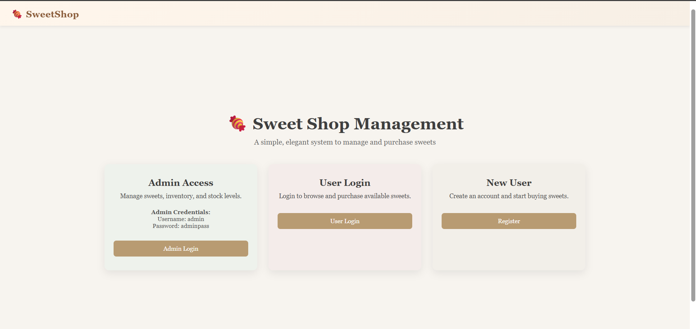
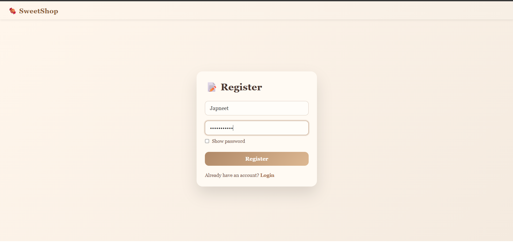
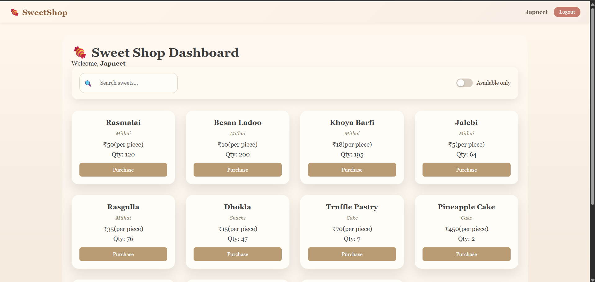
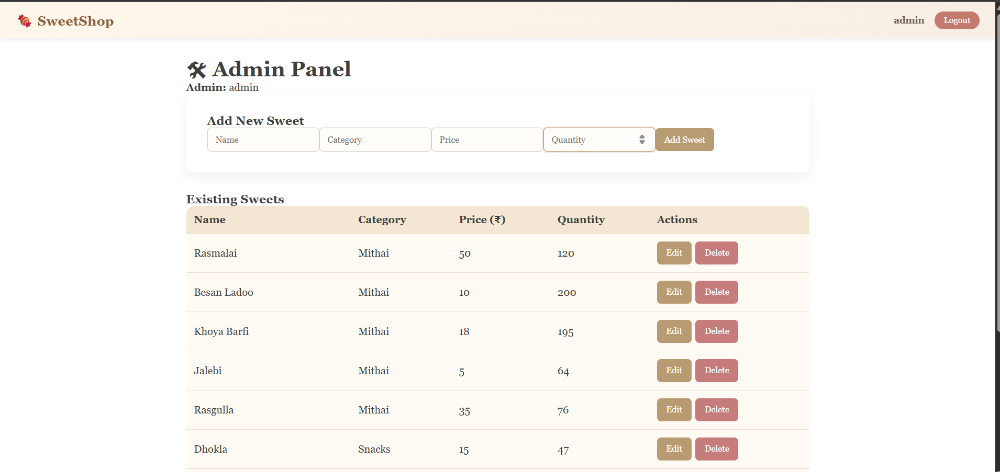

# 🍬 Sweet Shop Management System

A full-stack Sweet Shop Management System built as part of the Incubyte AI Kata.
The system allows admins to manage sweets inventory and users to browse and purchase sweets securely.

## Tech Stack

### Frontend
- React (Vite)
- React Router
- Axios
- Context API
- CSS (Classic pastel-vintage theme)

### Backend
- Node.js
- Express.js
- Sequelize ORM
- SQLite
- JWT Authentication
- bcrypt

## Features

### User
- Register & Login
- Browse sweets
- Search & filter sweets
- Purchase sweets

### Admin
- Admin login
- Add, update, delete sweets
- Restock inventory
- Role-based access control

## Project Structure

root/
├── backend/
│   ├── routes/
│   ├── models/
│   ├── middleware/
│   ├── tests/
│   ├── index.js
│   └── package.json
│
├── frontend/
│   ├── src/
│   ├── components/
│   ├── pages/
│   ├── App.jsx
│   └── package.json
│
└── README.md

## Backend Setup

cd backend
npm install
npm start

## for test

npm test

## Frontend Setup

cd frontend
npm install
npm run dev

## API Usage(POSTMAN)
POST /api/auth/login
Returns JWT token used in Authorization header:
Authorization: Bearer <token>

## Test Report

Backend tests were implemented using Jest and Supertest.

Test Results:
- Auth API tests: ✅ Passed
- Sweets API tests: ✅ Passed

Command used:
npm test

## My AI Usage

### AI Tools Used
- ChatGPT

### How I Used AI
- Used ChatGPT to clarify backend architecture and REST API design
- Used it to debug JWT authentication and role-based authorization
- Used AI assistance to design and refine Jest + Supertest test cases
- Used AI to improve UI layout and CSS styling decisions

### Reflection on AI Impact
AI significantly improved my development efficiency by helping identify bugs faster,
validate architectural choices, and refine both backend and frontend implementations.
All logic, business rules, and final decisions were reviewed, understood, and implemented by me.
AI acted as a development assistant rather than a replacement for problem-solving.

## Screenshots

### Landing Page

### Login/Register Page

### User Dashboard

### Admin Panel

## 🌐 Frontend Deployment

The frontend is deployed on Vercel and available at:
https://sweetshop-incubyte-eight.vercel.app/

This deployment demonstrates the UI and client-side functionality. 

Deployment Details: 

Platform: Vercel
Framework: React (Vite)
Build Command: npm run build
Output Directory: dist

The backend is intended to be run locally as described below.

Backend Connectivity

The backend itself is not deployed on Vercel due to its reliance on a persistent server process and a SQLite database, which are better suited for traditional hosting platforms.
